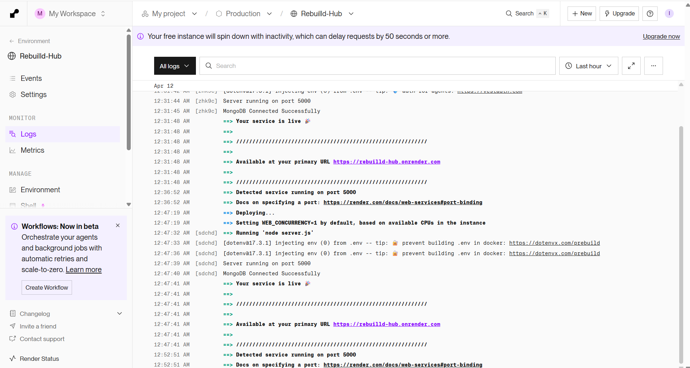
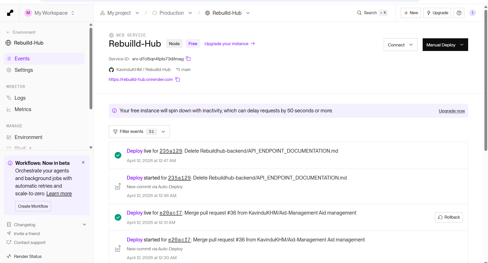
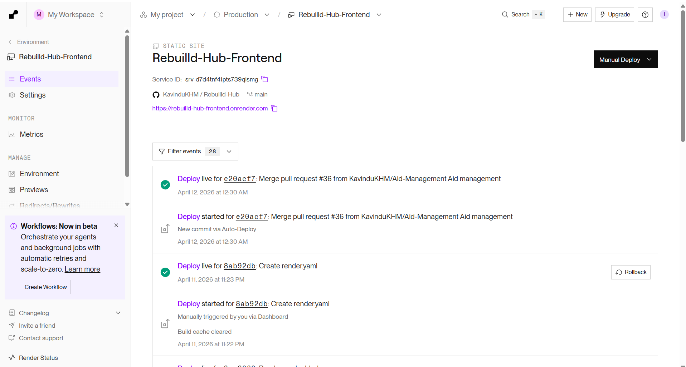
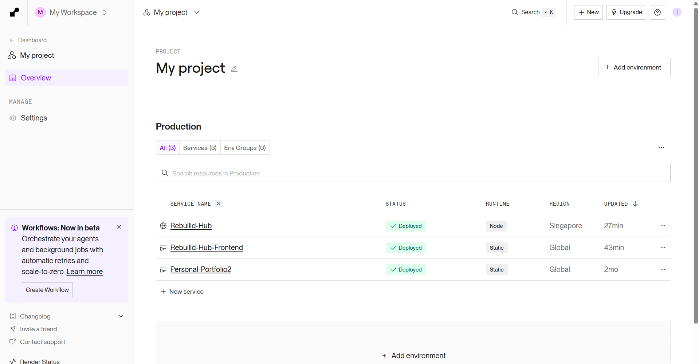

#### Deployed backend API - https://rebuilld-hub.onrender.com
#### Deployed frontend application - https://rebuilld-hub-frontend.onrender.com


## Screenshots of successful deployment 






# rebuildhub-frontend

Frontend SPA for RebuildHub built with React. This application provides role-based dashboards and UI workflows for disasters, reports, aid, volunteers, weather, resources, and donations.

## 1. Local Setup Guide (Step by Step)

### 1.1 Prerequisites

- Node.js 18+ (LTS recommended)
- npm 9+
- Running backend API at `http://localhost:5000`
- React

### 1.2 Clone and Install

1. Open terminal.
2. Clone and enter frontend folder:

```bash
git clone https://github.com/KavinduKHM/Rebuilld-Hub/tree/main
cd Rebuilld-Hub/rebuildhub-frontend
```

3. Install dependencies:

```bash
npm install
```

### 1.3 Environment Configuration

Current implementation uses hardcoded backend URLs (`http://localhost:5000`) in service and component calls.

No mandatory frontend `.env` keys are currently required to run local development.


### 1.4 Frontend .env keys

- REACT_APP_STRIPE_PUBLISHABLE_KEY
- VITE_API_BASE_URL

### 1.5 Backend .env keys
Create .env in Rebuildhub-backend/ and add:

PORT=5000
MONGODB_URL=
JWT_SECRET=

CLOUDINARY_CLOUD_NAME=
CLOUDINARY_API_KEY=
CLOUDINARY_API_SECRET=

WEATHER_API_KEY=

STRIPE_SECRET_KEY=
REACT_APP_STRIPE_PUBLISHABLE_KEY=

TWILIO_ENABLED=false
TWILIO_ACCOUNT_SID=
TWILIO_AUTH_TOKEN=
TWILIO_WHATSAPP_FROM=whatsapp:+14155238886
TWILIO_ASSIGNMENT_CONTENT_SID=

### 1.4 Run the Frontend

Use Vite dev server:

```bash
npm run dev
```

Alternative script available:

```bash
npm start
```

### 1.5 Verify Startup

- App should open in browser.
- Home page should load.
- Admin login page should be reachable at `/admin/login`.

## 2. Deployment Report

###	2.1 Deployment Objective

The deployment objective of RebuildHub is to publish both the frontend and backend as cloud-accessible services, so disaster reporting, aid workflows, volunteer coordination, and donation operations are available in real time to end users and administrators.

### 2.2 Deployment Architecture
RebuildHub is deployed as a two-tier web system:

1. Frontend Application
- React-based single-page application
- Hosts user interface for public users, volunteers, inventory staff, and administrators

2. Backend API Service
- Node.js and Express REST API
- Handles authentication, business logic, integrations, and data access

3. Database Layer
- MongoDB cloud database instance
- Stores users, disasters, damage reports, aid records, volunteers, inventory, and donation records

4. External Service Integrations
- Stripe for payment processing
- Cloudinary for image hosting
- Weather data provider API for weather and forecast
- Twilio WhatsApp integration for assignment notifications (optional and environment-driven)

### 2.3 Deployment Environments
The project uses separate environments for safe release management:

1. Development
- Local development and debugging
- Local frontend and backend communication

2. Production
- Publicly accessible deployed frontend and backend
- Production-grade environment variables and service credentials

### 2.4 Deployment Prerequisites
Before deployment, ensure the following are available:

1. Cloud hosting account for frontend and backend
2. Production MongoDB connection string
3. Production JWT secret
4. Production Stripe secret key
5. Cloudinary credentials
6. Weather API key
7. Optional Twilio credentials if WhatsApp notifications are enabled
8. Verified production frontend URL for backend CORS and payment return flows

### 2.5 Deployment Procedure Summary

1. Backend Deployment
- Provision the backend runtime in the hosting platform
- Configure all production environment variables
- Set the backend start command
- Confirm successful boot and database connection
- Validate core endpoints after deployment

2. Frontend Deployment
- Build and deploy the frontend artifact
- Confirm client routing behavior in production
- Verify that frontend API calls reach the deployed backend URL
- Validate role-based route behavior and protected pages

3. Post-Deployment Validation
- Perform smoke testing on login and role-based access
- Test disaster create and retrieval flow
- Test damage report submission with image upload
- Test aid and inventory flow
- Test donation initiation and payment verification redirect

### 2.6 Configuration and Secrets Management
Production credentials are managed through hosting platform environment settings, not hardcoded in source files.

Configuration principles used:

1. Environment-specific values are externalized
2. Sensitive values are never embedded in client code
3. Optional integrations can be toggled by flags
4. Redirect and callback URLs are environment-aware

### 2.7 Database and Data Integrity Considerations
Production database deployment includes:

1. Dedicated production database cluster
2. Restricted network and credential access
3. Data model consistency across deployment
4. Validation through CRUD and workflow tests after deployment

### 2.8 Deployment Verification Checklist
Use this checklist in your Word report to show successful deployment quality control:

1. Frontend URL opens without build errors
2. Backend base route responds successfully
3. Authentication login returns valid token
4. Protected routes enforce authorization
5. File upload endpoints accept and store images correctly
6. Donation and payment flow returns expected status
7. Event and weather endpoints return live data
8. No blocking runtime errors observed in production logs


### 2.9 Evidence of Deployment Progress and Team Delivery
Use your provided Git commit graph screenshot as process evidence.

What to state in report:
1. Commit history shows continuous feature and infrastructure evolution
2. Branch and merge history indicates coordinated team contribution
3. Deployment-related commits are visible (for example routing and hosting configuration updates)
4. Iterative fixes and redeploy cycles demonstrate release stabilization before final submission

Suggested caption for your screenshot:
Figure X: Commit graph showing iterative development, deployment-related updates, and merge history leading to production-ready release.

### 2.10 Rollback and Recovery Plan
In case of production issues, the recovery approach is:

1. Identify faulty release through logs and endpoint checks
2. Revert to the previous stable deployment version
3. Restore service configuration if any environment variable was changed incorrectly
4. Re-test critical user journeys before re-opening full access

### 2.11 Risks and Mitigations
Key deployment risks and controls:

1. Misconfigured environment variables
- Mitigation: Pre-deployment checklist and staged validation

2. Third-party API downtime
- Mitigation: Error handling and graceful response messaging

3. Payment callback mismatch
- Mitigation: Strict URL configuration and post-deploy checkout verification

4. CORS or cross-origin issues
- Mitigation: Explicit backend origin and header policy validation in production

### 2.12 Deployment Outcome Statement
The RebuildHub system deployment establishes a working production architecture where frontend and backend components are integrated with cloud database and external service providers. The deployment process includes verification checkpoints, commit-history evidence, and rollback readiness, supporting both technical reliability and assignment documentation requirements.

## 3. API Endpoint Documentation (used by backend)

Base URL: `http://localhost:5000`

Authentication for protected routes:

- Header: `Authorization: Bearer <JWT_TOKEN>`

Roles used by authorization middleware:

- `admin`
- `inventory_manager`
- `volunteer`
- `seeker`

### 3.1 Authentication (`/api/auth`)

| Method | Endpoint | Auth | Request Body | Success Response |
| --- | --- | --- | --- | --- |
| POST | `/api/auth/register` | Public | `{ name, email, password, role? }` | `201 { message }` |
| POST | `/api/auth/login` | Public | `{ email, password }` | `200 { token, user: { id, name, email, role } }` |

Example:

```bash
curl -X POST http://localhost:5000/api/auth/login \
  -H "Content-Type: application/json" \
  -d '{"email":"admin@example.com","password":"123456"}'
```

### 3.2 Disasters (`/api/disasters`)

| Method | Endpoint | Auth | Request Format | Success Response |
| --- | --- | --- | --- | --- |
| POST | `/api/disasters` | Public | `multipart/form-data` with `images[]` (max 5) + disaster fields | `201 { success, message, disaster, autoDamageReport }` |
| GET | `/api/disasters` | Public | None | `200 Disaster[]` |
| GET | `/api/disasters/:id` | Public | None | `200 Disaster` |
| PATCH | `/api/disasters/verify/:id` | Bearer + admin | `{ status: "Verified"\|"Rejected"\|"Pending" }` | `200 { success, message, data }` |
| POST | `/api/disasters/:id/assign-volunteer` | Public (business checks volunteer state) | `{ volunteerId? , volunteerEmail? }` | `200 { success, message, data, notification }` |
| PUT | `/api/disasters/:id` | Public | JSON or multipart partial update | `200 Disaster` |
| DELETE | `/api/disasters/:id` | Public | None | `200 { message }` |

### 3.3 Damage Reports (`/api/reports`)

| Method | Endpoint | Auth | Request Format | Success Response |
| --- | --- | --- | --- | --- |
| POST | `/api/reports` | Public | `multipart/form-data` with `images[]` (max 5) + report fields | `201 { success, message, data }` |
| GET | `/api/reports/disaster/:disasterId` | Public | None | `200 { success, data: DamageReport[] }` |
| GET | `/api/reports/:id` | Public | None | `200 { success, data: DamageReport }` |
| PATCH | `/api/reports/verify/:id` | Bearer + admin | `{ status: "Approved"\|"Rejected"\|"Verified" }` | `200 { success, message, data }` |

### 3.4 Aids (`/api/aids`)

| Method | Endpoint | Auth | Request Body | Success Response |
| --- | --- | --- | --- | --- |
| POST | `/api/aids` | Public | `{ damageReportId, aidType, quantity, location }` | `201 Aid` |
| GET | `/api/aids` | Bearer | None | `200 Aid[]` |
| GET | `/api/aids/:id` | Bearer | None | `200 Aid` |
| PUT | `/api/aids/:id/admin-decision` | Bearer + admin | `{ decision: "APPROVED"\|"REJECTED" }` | `200 Aid` |
| PUT | `/api/aids/:id/distribution` | Bearer + admin | `{ status: "PENDING"\|"IN_PROGRESS"\|"COMPLETED" }` | `200 Aid` |
| DELETE | `/api/aids/:id` | Bearer + admin | None | `200 { message }` |
| GET | `/api/aids/__routes` | Public | None | `200 [{ path, methods }]` |

Sample aid request:

```json
{
  "damageReportId": "67f0abc123...",
  "aidType": "Food",
  "quantity": 50,
  "location": {
    "country": "Sri Lanka",
    "province": "Western",
    "district": "Colombo",
    "city": "Maharagama"
  }
}
```

### 3.5 Volunteers (`/api/volunteers`)

| Method | Endpoint | Auth | Request Body | Success Response |
| --- | --- | --- | --- | --- |
| GET | `/api/volunteers/test` | Public | None | `200 { success, message, time }` |
| GET | `/api/volunteers/debug` | Public | None | `200 { success, message, time }` |
| GET | `/api/volunteers` | Public | None | `200 { success, count, data }` |
| POST | `/api/volunteers/register` | Public | `{ name, email, phone, district, skills[], availability? }` | `201 { message, data }` |
| GET | `/api/volunteers/:id` | Public | None | `200 { success, data }` |
| PUT | `/api/volunteers/:id` | Public | partial volunteer fields | `200 { success, message, data }` |
| DELETE | `/api/volunteers/:id` | Public | None | `200 { success, message }` |

### 3.6 Events (`/api/events`)

| Method | Endpoint | Auth | Request Format | Success Response |
| --- | --- | --- | --- | --- |
| GET | `/api/events/fetch` | Public | query: `location=worldwide\|srilanka`, `category=all\|...` | `200 { success, message, data }` |
| GET | `/api/events` | Public | query: `location, category, days, limit` | `200 { success, count, location, category, data }` |
| GET | `/api/events/categories` | Public | None | `200 { success, data }` |
| GET | `/api/events/live` | Public | query: `location, category, days, limit` | `200 { success, source, location, category, count, data }` |
| GET | `/api/events/live/srilanka` | Public | query: `category, days, limit` | `200 { success, source, location, category, count, data }` |
| GET | `/api/events/live/map` | Public | query: `location, category, days, limit` | `200 { success, source, location, category, count, geojson }` |
| GET | `/api/events/live/map/view` | Public | query params optional | `200 HTML` |
| GET | `/api/events/:id` | Public | None | `200 { success, data }` |
| POST | `/api/events/:id/interest` | Public | `{ volunteerId?, eventData? }` | `200 { success, message }` |

### 3.7 Weather (`/api/weather`)

| Method | Endpoint | Auth | Request Format | Success Response |
| --- | --- | --- | --- | --- |
| GET | `/api/weather` | Public | query: `city=<cityName>` | `200 OpenWeather current weather payload` |
| GET | `/api/weather/forecast` | Public | query: `city=<cityName>` | `200 OpenWeather forecast payload` |

Example:

```bash
curl "http://localhost:5000/api/weather?city=Colombo"
```

### 3.8 Inventory (`/Rebuildhub/inventory`)

| Method | Endpoint | Auth | Request Body | Success Response |
| --- | --- | --- | --- | --- |
| POST | `/Rebuildhub/inventory` | Bearer + admin | `{ type, name, category?, unit?, totalQuantity?, totalAmount?, description? }` | `201 Inventory` |
| GET | `/Rebuildhub/inventory` | Public | None | `200 Inventory[]` |
| GET | `/Rebuildhub/inventory/:id` | Public | None | `200 Inventory` |
| PUT | `/Rebuildhub/inventory/:id` | Bearer + admin | partial inventory fields | `200 Inventory` |
| DELETE | `/Rebuildhub/inventory/:id` | Bearer + admin | None | `200 { message }` |

### 3.9 Donations (`/Rebuildhub/donations`)

| Method | Endpoint | Auth | Request Format | Success Response |
| --- | --- | --- | --- | --- |
| GET | `/Rebuildhub/donations/health` | Public | None | `200 { status, message }` |
| POST | `/Rebuildhub/donations/create-checkout-session` | Public | `{ amount, donorName, donorNIC, inventoryId, email?, name?, description?, isInternational?, originalCurrency?, originalAmount? }` | `200 { success, url, sessionId, donationId }` |
| GET | `/Rebuildhub/donations/verify-payment` | Public | query: `session_id`, `donation_id?` | `200 { success, message, donation? }` |
| GET | `/Rebuildhub/donations/stats` | Public | None | `200 donation stats` |
| GET | `/Rebuildhub/donations/donor/:donorNIC` | Public | None | `200 Donation[]` |
| GET | `/Rebuildhub/donations/session/:sessionId` | Public | None | `200 Donation` |
| POST | `/Rebuildhub/donations` | Public | donation payload | `201 Donation` |
| GET | `/Rebuildhub/donations` | Public | None | `200 Donation[]` |
| GET | `/Rebuildhub/donations/:id` | Public | None | `200 Donation` |
| PATCH | `/Rebuildhub/donations/:id` | Public | partial donation fields | `200 Donation` |
| DELETE | `/Rebuildhub/donations/:id` | Public | None | `200 { message }` |

### 3.10 Payment (`/Rebuildhub/payment`)

| Method | Endpoint | Auth | Request Body | Success Response |
| --- | --- | --- | --- | --- |
| POST | `/Rebuildhub/payment` | Public | `{ amount, currency? }` | `200 { clientSecret, status }` |

## 4. Authentication Requirements Summary

Protected endpoints and roles:

- Bearer token required:
  - `GET /api/aids`
  - `GET /api/aids/:id`
- Bearer + admin:
  - `PUT /api/aids/:id/admin-decision`
  - `PUT /api/aids/:id/distribution`
  - `DELETE /api/aids/:id`
  - `PATCH /api/disasters/verify/:id`
  - `PATCH /api/reports/verify/:id`
  - `POST /Rebuildhub/inventory`
  - `PUT /Rebuildhub/inventory/:id`
  - `DELETE /Rebuildhub/inventory/:id`

Common auth errors:

- `401 { message: "No token provided" }`
- `401 { message: "Invalid token" }`
- `403 { message: "Admin access only" }`
- `403 { message: "Access denied" }`

## 5. Request/Response Format Notes

- Most endpoints use JSON request/response.
- Upload endpoints use multipart form data with images field.
- API response shapes differ slightly by module (some wrap in success/data, others return model objects directly).


## 6. Frontend Route Documentation

The app uses React Router with a ProtectedRoute role guard.

| Path | Access | Purpose |
| --- | --- | --- |
| `/` | Public | Home page |
| `/admin/login` | Public | Admin and staff login |
| `/dashboard` | Admin only | Admin dashboard |
| `/admin/dashboard` | Admin only | Admin dashboard alias |
| `/admin/aid-requests` | Admin only | Aid approval workflow |
| `/admin/aid-completed` | Admin only | Completed aid list |
| `/admin/resources` | Admin only | Resource management |
| `/admin/donations` | Admin only | Donation administration |
| `/inventory/dashboard` | Inventory manager only | Inventory manager dashboard |
| `/volunteer/dashboard` | Volunteer only | Volunteer dashboard |
| `/volunteer/apply` | Public | Volunteer registration |
| `/admin/volunteers` | Admin only | Volunteer management |
| `/disasters` | Public | Disaster list |
| `/disasters/new` | Public | Create disaster form |
| `/disasters/:id` | Public | Disaster details |
| `/reports/new` | Public | Damage report submission |
| `/damage/:id` | Public | Damage report details |
| `/aid/verified-reports` | Public | Verified reports list |
| `/aid/request` | Public | Aid request form |
| `/weather` | Public | Weather dashboard |
| `/resources` | Public | Resource listing and donation navigation |
| `/donate` | Public | Donation form |
| `/donate/:itemId` | Public | Donation form for selected item |
| `/donation-success` | Authenticated user | Post-payment success page |

## 7. API Endpoint Documentation (Used by Frontend)

Frontend calls backend at `http://localhost:5000`.

### 7.1 Authentication

| Method | Endpoint | Used For | Auth |
| --- | --- | --- | --- |
| POST | `/api/auth/login` | Login from admin login and auth context | Public |
| POST | `/api/auth/register` | Registration call in auth context | Public |

Response typically includes token and user object.

### 7.2 Disaster and Damage Modules

| Method | Endpoint | Used For | Auth |
| --- | --- | --- | --- |
| GET | `/api/disasters` | Disaster list | Public |
| GET | `/api/disasters/:id` | Disaster detail | Public |
| POST | `/api/disasters` | Create disaster with images | Public |
| PUT | `/api/disasters/:id` | Update disaster | Public |
| PATCH | `/api/disasters/verify/:id` | Verify disaster | Bearer + admin |
| DELETE | `/api/disasters/:id` | Delete disaster | Public |
| POST | `/api/disasters/:id/assign-volunteer` | Assign volunteer | Public |
| GET | `/api/reports/disaster/:disasterId` | List reports for a disaster | Public |
| GET | `/api/reports/:id` | Report detail | Public |
| POST | `/api/reports` | Submit report with images | Public |
| PATCH | `/api/reports/verify/:id` | Verify report | Bearer + admin |

### 7.3 Aid Module

| Method | Endpoint | Used For | Auth |
| --- | --- | --- | --- |
| POST | `/api/aids` | Submit aid request | Public |
| GET | `/api/aids` | View aid requests | Bearer |
| PUT | `/api/aids/:id/admin-decision` | Admin approval/rejection | Bearer + admin |
| PUT | `/api/aids/:id/distribution` | Update distribution status | Bearer + admin |

### 7.4 Volunteer and Events

| Method | Endpoint | Used For | Auth |
| --- | --- | --- | --- |
| POST | `/api/volunteers/register` | Volunteer apply form | Public |
| GET | `/api/volunteers` | Volunteer lists | Public |
| GET | `/api/volunteers/:id` | Volunteer profile fetch | Public |
| PUT | `/api/volunteers/:id` | Volunteer updates/verification | Public |
| DELETE | `/api/volunteers/:id` | Volunteer delete | Public |
| GET | `/api/events` | Stored event feeds | Public |
| GET | `/api/events/live` | Live event feed | Public |
| GET | `/api/events/categories` | Category options | Public |
| POST | `/api/events/:id/interest` | Express volunteer interest | Public |

### 7.5 Weather and Resources

| Method | Endpoint | Used For | Auth |
| --- | --- | --- | --- |
| GET | `/api/weather` | Current weather | Public |
| GET | `/api/weather/forecast` | Forecast | Public |
| GET | `/Rebuildhub/inventory` | Display resources/inventory | Public |
| POST | `/Rebuildhub/inventory` | Create inventory | Bearer + admin |
| PUT | `/Rebuildhub/inventory/:id` | Update inventory | Bearer + admin |
| DELETE | `/Rebuildhub/inventory/:id` | Delete inventory | Bearer + admin |
| POST | `/Rebuildhub/donations` | Record donation | Public |
| GET | `/Rebuildhub/donations` | Donation listing | Public |
| GET | `/Rebuildhub/donations/verify-payment` | Verify Stripe return session | Public |
| POST | `/Rebuildhub/donations/create-checkout-session` | Start Stripe checkout | Public |


## 8. Authentication and Session Handling

- JWT token is stored in localStorage.
- Axios API client attaches bearer token automatically when token exists.
- ProtectedRoute checks:
	- token existence
	- optional allowed roles
- Unauthorized users are redirected to home route.

## 9. Example API Calls from Frontend Flow

```bash
# Login
curl -X POST http://localhost:5000/api/auth/login \
	-H "Content-Type: application/json" \
	-d '{"email":"admin@example.com","password":"123456"}'

# Load resources page inventory
curl http://localhost:5000/Rebuildhub/inventory

# Volunteer registration
curl -X POST http://localhost:5000/api/volunteers/register \
	-H "Content-Type: application/json" \
	-d '{"name":"Test","email":"t@example.com","phone":"0771234567","district":"Colombo","skills":["First Aid"]}'
```

## 10. Build and Test Commands

```bash
npm run dev
npm run build
npm test
```

## 11. State Management, Architecture, and Session Handling

### 11.1 State Management Approach
Local UI state is managed with React hooks such as useState, useEffect, useMemo, and useEffectEvent.
Global authentication/session state is managed with Context API (AuthContext).
API communication is centralized in an Axios instance with request/response interceptors.

### 11.2 Architecture Justification
This project uses functional components and hooks instead of class components or Redux-heavy architecture because:

Most state is feature-local (form, map, filter, panel state), making hooks a lightweight fit.
Auth state is global but compact, so Context API is sufficient and keeps complexity low.
Functional composition keeps route guards, map logic, and page concerns modular.

### 11.3 Session Management and Protected Routes
Session data (token and user) is stored in localStorage.
ProtectedRoute enforces authentication and role-based authorization.
Unauthorized users are redirected to login; role mismatches are redirected to dashboard.
Axios handles 401 globally by clearing session and redirecting to login.

## 12. UI/UX Framework and Responsiveness
Tailwind CSS is used as the styling framework.
The interface is responsive across mobile and desktop layouts.
Components include role-aware navigation, map overlays, and adaptive panels for map workflows.

## 13 Testing Instruction Report

### 13.1 Testing Environment Configuration Details

This project uses a JavaScript full-stack environment with separate backend and frontend applications.

-	Operating system support: Windows, Linux, or macOS
-	Runtime: Node.js version 18 or higher
-	Package manager: npm version 9 or higher
-	Backend technology stack: Node.js, Express, MongoDB
-	Frontend technology stack: React
-	Backend testing dependencies available: Jest, Supertest
-	Frontend testing dependencies available: React Testing Library, Jest DOM

Test environment variables used for controlled testing:

- NODE_ENV = test
- Dedicated MongoDB test connection string
- Test-safe API keys or mock keys for third-party services (Stripe, Cloudinary, Weather API, Twilio)

Isolation strategy for testing environment:

- Use a separate test database from development and production
- Do not run tests against production services
- Use mocks/stubs for external APIs where possible
- Reset test data before each run to ensure reproducibility


### 13.2 Unit Testing Setup and Execution

Current status:

- Frontend test command is available and executable.
- Backend has testing libraries installed, but unit test suites are currently in setup phase.
- This means the backend test command needs script/test-file completion before meaningful unit execution.

How to run unit tests (frontend):

1. Open terminal in the frontend project folder.
2. Install dependencies (if not already installed).
3. Run:
   - npm test

Recommended backend unit test setup:

1. Add a Jest-based backend test script.
2. Create unit test files for:
   - Controllers
   - Services
   - Utility functions
3. Mock external dependencies and database calls for pure unit isolation.

Recommended backend unit execution:

1. Open terminal in backend project folder.
2. Run:
   - npm test

Expected unit testing outcomes to report:

- Number of test cases executed
- Number of passed/failed tests
- Component-level validation of business logic
- Fast execution without requiring full system startup


### 13.3 Integration Testing Setup and Execution

Purpose:

Integration testing validates how multiple modules work together (routes, middleware, controllers, services, and database operations).

Proposed setup used in this project architecture:

- Test backend API endpoints through HTTP request simulation
- Use Supertest with the Express app instance
- Connect to a test MongoDB instance or in-memory database
- Seed required data before tests
- Clear test collections after tests

Integration test execution steps:

1. Ensure backend dependencies are installed.
2. Set test environment variables.
3. Start integration test run:
   - npm test
4. Validate API workflows end-to-end:
   - Authentication flow
   - Disaster creation and retrieval
   - Damage report submission and verification
   - Aid request and admin decision flow
   - Inventory and donation route behavior

What to include in your report results table:

- Tested endpoint
- Test scenario description
- Expected status code
- Actual status code
- Result (Pass/Fail)


### 13.4 Performance Testing Setup and Execution

Current status:

- Dedicated performance test scenario files are not yet committed.
- Performance testing is planned as the next implementation phase.

Recommended performance testing tool:

- Artillery (lightweight and suitable for REST API load simulation)

Performance testing setup:

1. Install Artillery as a dev dependency or use npx.
2. Create a load profile file defining:
   - Target base URL
   - Test phases (warm-up, ramp-up, sustained load)
   - Endpoint scenarios
3. Focus on critical endpoints such as:
   - Authentication login
   - Disaster listing
   - Inventory listing
   - Donation checkout session creation

Performance execution steps:

1. Start backend server locally.
2. Run load test using the scenario file.
3. Collect and export performance metrics.

Metrics to report:

- Total requests sent
- Successful response count
- Error count and error types
- Average response time
- P95 latency
- P99 latency
- Requests per second throughput

### 13.5 Consolidated Testing Execution Commands

Frontend:

1. Install dependencies:
   - npm install
2. Run unit tests:
   - npm test

Backend:

1. Install dependencies:
   - npm install
2. Run tests:
   - npm test

Performance (after adding scenario file):

1. Start backend:
   - npm run dev
2. Run load test:
   - npx artillery run load-test.yml


### 13.6 Current Testing Maturity Statement 

The project is prepared for structured testing with required libraries and architecture support. Frontend test execution is available through the configured test command. Backend testing dependencies are present and integration/unit test suites are currently being formalized. Performance testing is planned with Artillery-based load scenarios targeting high-impact API endpoints. This staged approach ensures reliable functionality verification, controlled integration validation, and scalable performance assessment as the project progresses.


## 14. Backend Deployment (Render)

Platform: Render – Web Service

Live URL: https://rebuilld-hub.onrender.com

### 14.1 Setup Steps
- Push code to GitHub
- Ensure the backend (Express.js + MongoDB) is in a GitHub repository.

- Create a Web Service on Render

- Log in to Render dashboard.

- Click New + → Web Service.

- Connect respective GitHub repository.

### 14.2 Configure the service:

- Name: rebuildhub-api

- Environment: Node

- Build Command: npm install

- Start Command: node server.js (or npm start)

- Plan: Free tier (or as needed)

- Set environment variables
In the Web Service dashboard, go to Environment and add:

env
MONGO_URI = 
PORT = 5000
JWT_SECRET =
NODE_ENV = 

### 14.3 Deploy

Render automatically deploys on every push to the configured branch (e.g., main).
After deployment, the API is available at https://rebuilld-hub.onrender.com.


## 15. Frontend Deployment (Render)

- Platform: Render – Static Site

- Live URL: https://rebuilld-hub-frontend.onrender.com

### 15.1 Setup Steps

- Prepare your React (Vite) app

- Ensure package.json contains the correct build script:

json
"scripts": {
  "build": "vite build"
}
- Create a vercel.json or render.yaml (optional – not required for Render static site).

- If your app uses environment variables (e.g., VITE_API_BASE_URL), create a .env file locally for testing but do not commit it.

- Push code to GitHub
- Make sure the frontend code is in the same or a separate repository.

- Create a Static Site on Render

- In Render dashboard, click New + → Static Site.

- Connect the GitHub repository.

- Configure the static site:

- Branch: main

- Root Directory: rebuildhub-frontend (if the package.json is inside that subfolder; otherwise leave empty)

- Build Command: npm install && npm run build

- Publish Directory: dist (or ./dist – the output folder of Vite)

- Set environment variables

env
VITE_API_BASE_URL = https://rebuilld-hub.onrender.com

### 15.2 Deploy

Click Create Static Site. Render will clone the repo, install dependencies, build the app, and serve the dist folder.
The site is automatically redeployed on every push to the selected branch.

Verify

Open the provided URL (e.g., https://rebuildhub-frontend.onrender.com).

Check the browser’s network tab – API calls should go to your live backend and return 200.


## 14. Notes

- Frontend currently mixes Axios and Fetch calls.
- Base backend URL is currently hardcoded in multiple files.
- For production readiness, centralizing base URL in env variables is recommended.
